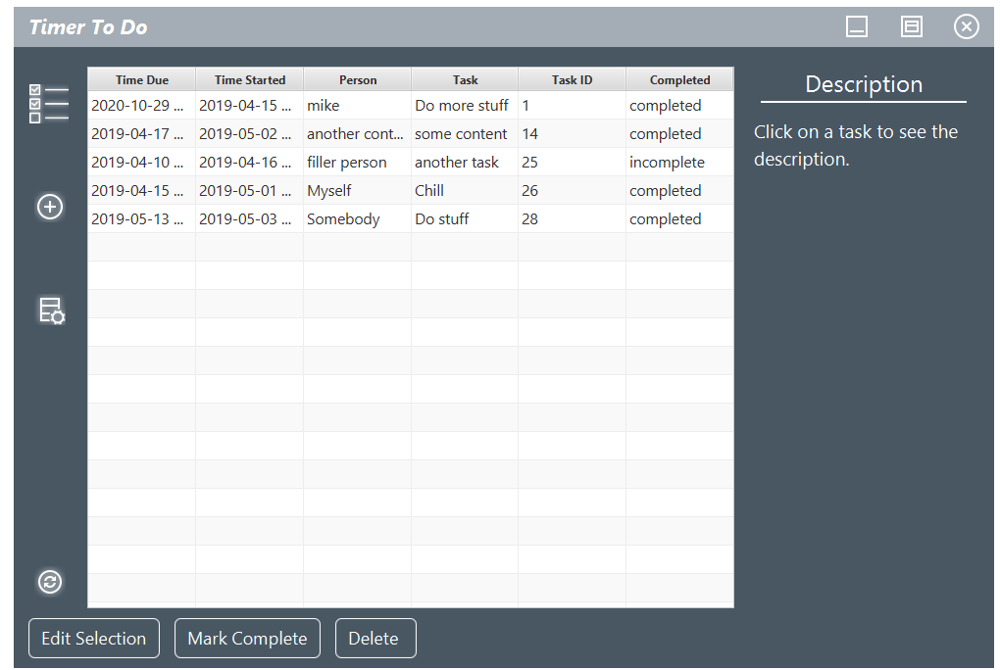

# TimerToDo
A to-do list that uses JDBC to connect to a MySQL server and store data entered by users. Eventually, this could serve as a small company's invoice system or something along those lines, given this project's continued development. Keeping track of who does what job, the cost, and their deadlines is made easy. 

If you'd like to see a demonstration, you can check it out [here](www.youtube.com)

This project relies on a MySQL database called "todolist" with a table called "list_items". As this software is obviously not consumer ready in its current state, to use this software, you must make a MySQL database and table named appropriately . The following is an example of a creation script that would work:

```
create table list_items
(
	time_due datetime, 
	time_started timestamp default current_timestamp on update current_timestamp, 
	person varchar(255), 
	task varchar(20), 
	task_description varchar(255),
	completed boolean default false, 
	task_id int auto_increment,
	primary key (task_id)
);
```

I will eventually build and host a server to host this as a service with SSL.





###### If you want to fork this repository, or you would like to edit the code, it is important for you to know that this project was made using the Eclipse IDE with Java 1.8 using [JPhoenix](https://github.com/jfoenixadmin/JFoenix) and JavaFX. You must import JFoenix if you want the code to run.
